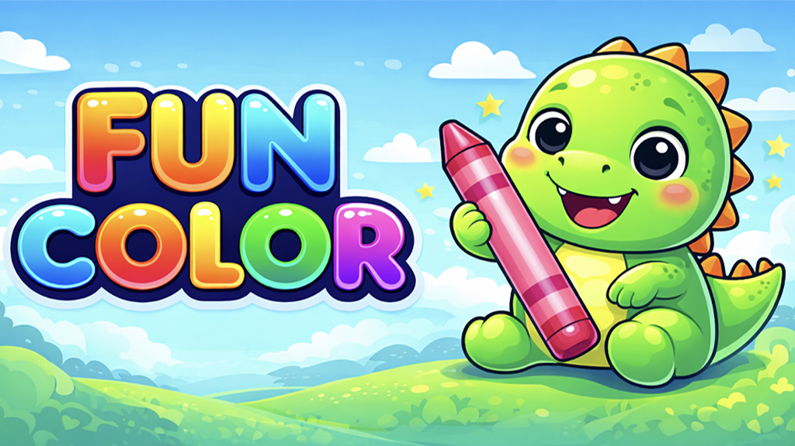
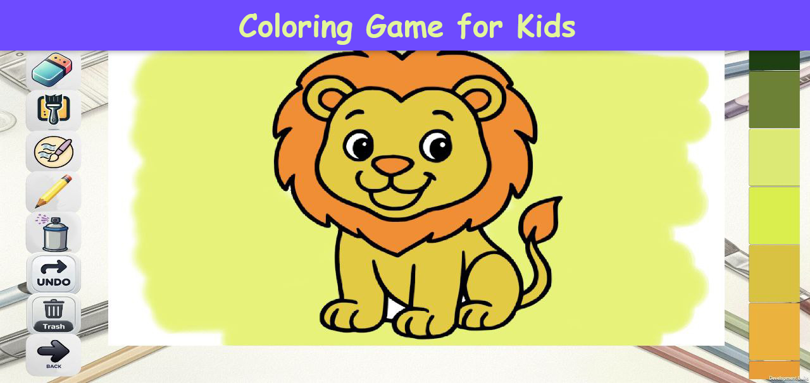
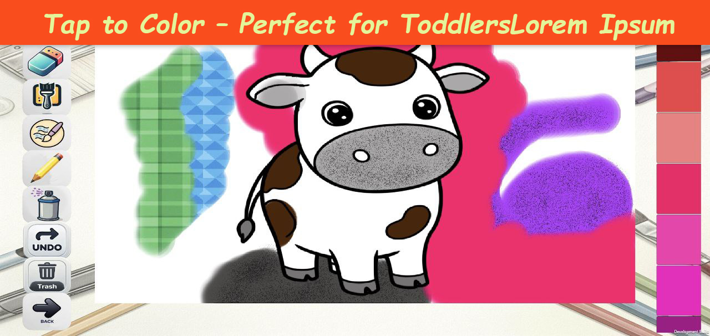
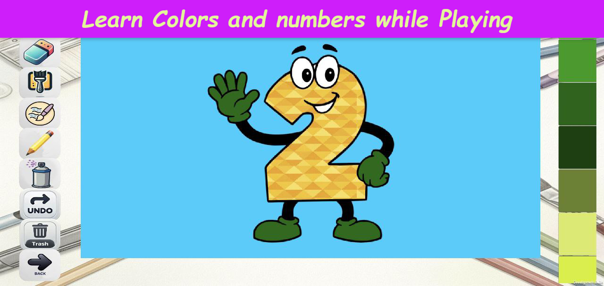
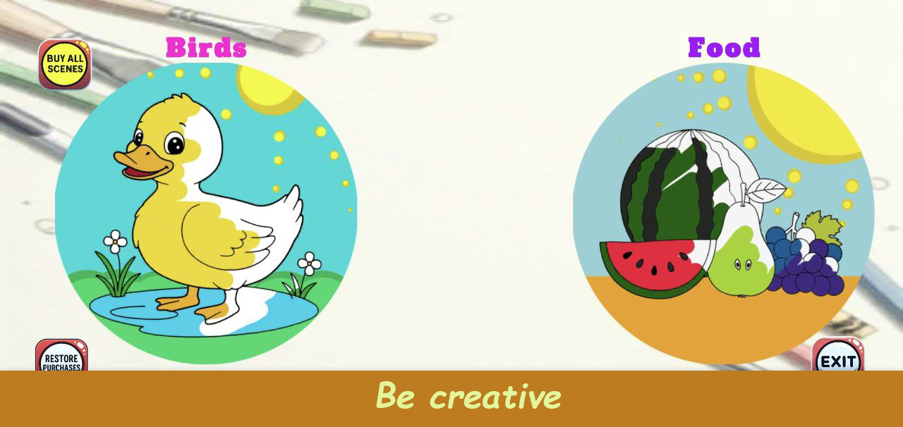
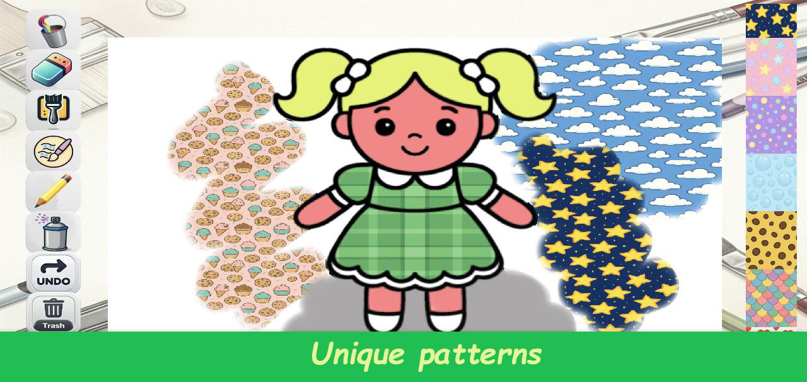
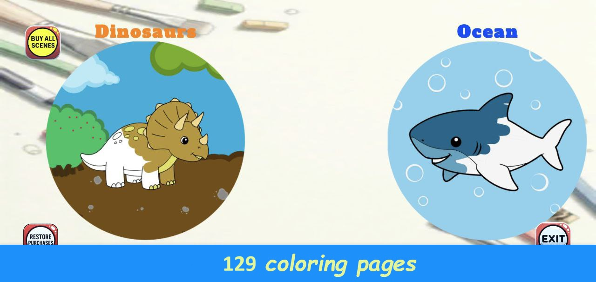

# FunColor

FunColor is a coloring game for kids and toddlers, designed as a fun and educational drawing app for Android.

The game helps children learn colors, improve fine motor skills, and enjoy creative play through adorable categories such as animals, dinosaurs, and vehicles.

## About the Project
FunColor is a simple and child-friendly coloring app created for preschoolers and young children.  
Players can tap or drag to color pictures using an easy-to-use interface designed for small hands.

This repository is a showcase of the project and does not include the source code.

## Features
- Coloring game for kids aged 2–6
- Easy tap-to-color interaction
- Categories with animals, dinosaurs, cars, and more
- Preschool-friendly design
- Safe and simple interface for toddlers
- Relaxing and educational gameplay

## Educational Value
FunColor supports the development of:
- Fine motor skills
- Hand-eye coordination
- Color recognition
- Creativity and imagination
- Focus and attention

## Project Info
- **Title:** FunColor
- **Engine:** Unity
- **Platform:** Android
- **Genre:** Educational / Casual / Kids Coloring Game

## Screenshots

## Note
The source code is private.  
This repository is published only for portfolio and presentation purposes.

[Download on Google Play] https://play.google.com/store/apps/details?id=com.company.funcolor&pcampaignid=web_share
